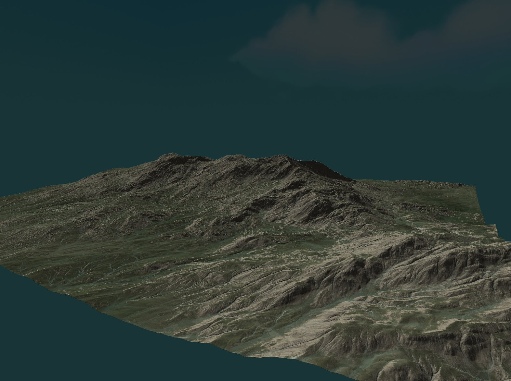

# Metal Sandbox

A real-time 3D renderer built on Apple Metal 4, written in C++ and Objective-C++.



---

## What it renders

- **EXR heightmap terrain** — 32-bit float HDR heightmap loaded via tinyEXR, displaced into a dense mesh on the CPU, rendered with per-fragment lighting and normal computation in Metal shaders
- **Cubemap skybox** — 6-face skybox rendered behind the scene
- **FPS camera** — free-look navigation through the scene
- **Stable real-time loop** — AppKit window + Metal 4 command queue, depth-tested, no flickering

---

## Architecture

Built directly on Metal 4 (`MTL4CommandQueue`, `MTL4CommandBuffer`, `MTL4CommandAllocator`) with no engine or framework in between.

```
AppKit (window, input)
        │
        ▼
   GAL (Graphics Abstraction Layer)    ← integer handle API, no exposed Metal types
        │
   Metal 4 Backend (Objective-C++)
        ├── MTL4CommandQueue / MTL4CommandBuffer / MTL4CommandAllocator
        ├── MTLSharedEvent for CPU↔GPU sync (monotonic frame counters)
        ├── Argument table resource binding
        └── Depth buffer (format inferred at runtime)
```

The GAL sits on top of Metal 4 and exposes an integer handle-based public API — no Metal types leak through the interface. The design anticipates a future Vulkan backend.

---

## Pipeline

```
EXR file  ──► tinyEXR ──► float heightmap ──► CPU mesh generation ──► vertex buffer
PNG file  ──► custom PNG parser ──► texture upload
Cubemap   ──► stb_image ──► 6-face texture
                                               │
                                               ▼
                                     Metal 4 render pass
                                     (terrain + skybox + depth test)
```

Notable: the PNG parser in this repo is a custom implementation with a hand-written DEFLATE decoder — no libpng dependency.

---

## Technical highlights

- Metal 4 command model with explicit allocator/buffer separation
- CPU↔GPU synchronization via `MTLSharedEvent` with monotonic frame counters — no `waitForDrawable` blocking on the CPU
- Depth buffer pixel format inferred at runtime (Metal 4 does not expose `depthAttachmentPixelFormat` on pipeline descriptors)
- Shader layout: stride-5 vertex data (xyz + uv), matrices passed via struct buffer, texture binding via argument tables
- No STL — custom allocators, containers, and a slotmap-backed handle system from [Core-Library](https://github.com/yahya-systems/Core-Library)
- Discovered and submitted an Apple GPU driver bug: `newBufferWithBytes:length:options:` segfaults on large private allocations on Metal 4

---

## Project structure

```
Metal_Sandbox/
├── Core/           # Core runtime (allocators, containers, math)
├── Shaders/        # Metal shader source (.metal)
├── include/gal/    # GAL public API (integer handles, error codes)
├── src/            # GAL Metal 4 backend (Objective-C++)
├── png-parser/     # Custom PNG parser with hand-written DEFLATE decoder
├── tinyExr/        # EXR image loading
├── stb_image/      # Cubemap face loading
├── window-manager/ # AppKit window + input abstraction
└── main.cpp        # Scene setup and render loop
```

---

## Building

```bash
git clone --recurse-submodules https://github.com/yahya-systems/Metal_Sandbox
cd Metal_Sandbox
cmake -B build -G Ninja
cmake --build build
```

Requires: macOS with Apple Silicon, Xcode command line tools, CMake ≥ 3.20.

---

## Status

Active development. Terrain, skybox, FPS camera, and EXR heightmap loading are stable. This sandbox is the proving ground for the GAL before it gains a Vulkan backend.
